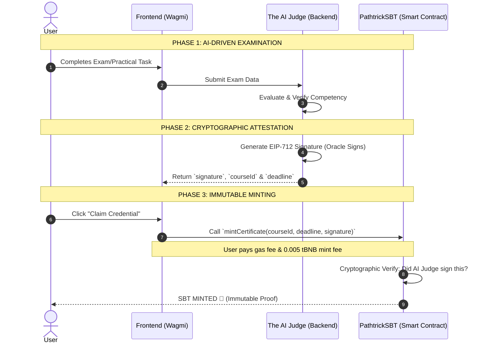

# 🌟 PATHTRICK

**A verifiable, decentralized AI-Native Career Coach on BNB Smart Chain.**
It evaluates skills through an objective AI engine, signs graduation proofs securely via EIP-712 cryptography, and issues immutable credentials as Soulbound Tokens (SBT).

🏆 **Indonesia Web3 Hackathon Submission**

| | |
|---|---|
| 🌐 **Live App** | [pathtrick.vercel.app](https://pathtrick.vercel.app) |
| 📜 **Smart Contract** | [`0x39632892C33435a76043343Ef17Ac03124627ba9`](https://testnet.bscscan.com/address/0x39632892C33435a76043343Ef17Ac03124627ba9) |
| ⛓️ **Network** | BNB Smart Chain Testnet (Chain ID 97) |
| ☁️ **Hosting** | Frontend on Vercel · Backend on Railway |

---

## Table of Contents
- [What Pathtrick Is](#what-pathtrick-is)
- [Problem & Solution](#problem--solution)
- [Key Features](#key-features)
- [Tech Stack](#tech-stack)
- [How It Works (Mechanism)](#how-it-works-mechanism)
- [Backend API & AI Agents](#backend-api--ai-agents)
- [Repository Structure](#repository-structure)
- [Quickstart](#quickstart)
- [On-Chain (BNB Smart Chain Testnet, Chain 97)](#on-chain-bnb-smart-chain-testnet-chain-97)
- [Deployment & CI/CD](#deployment--cicd)
- [Security Model](#security-model)
- [Team](#team)

---

## WHAT PATHTRICK IS

Pathtrick is an autonomous career coaching and certification platform built on three commitments:

**Personalized Learning.** The AI acts as a dedicated career coach, curating study materials and guiding users through educational paths tailored to their specific career goals.

**Objective AI Evaluation.** Exams are graded deterministically by *The AI Judge*. It eliminates human bias, subjectivity, and manual manipulation from the grading process.

**Immutable Proof.** Once passed, the certification is minted as a Soulbound Token (SBT) on BNB Smart Chain. It is non-transferable, permanently attached to the user's digital identity, and easily verifiable by recruiters worldwide.

---

## PROBLEM & SOLUTION

Most Web3 educational platforms serve merely as "digital stampers" for conventional human institutions. They take off-chain, human-graded results and simply put them on a blockchain. This traditional approach leaves the quality of education vulnerable to human bias and makes it easy to manipulate or backdate credentials.

**Pathtrick solves this through a "Closed-Loop" AI-to-Blockchain system.**
We do not just place a certificate on the blockchain; we mathematically guarantee the authenticity of the skill behind it. By eliminating the human intermediary, every credential issued is an objective, tamper-proof reflection of true competency.

---

## KEY FEATURES

- 🧭 **AI Career Assessment** — Onboarding test that maps users to a RIASEC profile (Dreamer) or a skill-gap analysis (Chaser).
- 🗺️ **Personalized Career & Learning Path** — AI-generated missions, courses, and quests tailored to each user's goal.
- 🎮 **Gamified RPG Experience** — Built with Phaser: XP, lives, houses, leaderboard, and boss-fight style exams.
- ⚖️ **The AI Judge** — Objective, rubric-based grading of essay answers with deterministic `PASS` / `FAIL` output.
- 🎓 **Soulbound Certificates** — Non-transferable BEP-1155 tokens minted only with the AI Judge's EIP-712 signature.
- 🏫 **Opportunities Hub** — Curated universities, scholarships, and job listings connected to the user's path.
- 🔐 **Web2.5 Onboarding** — Login with email/social via Privy, with an embedded wallet created automatically.

---

## TECH STACK

| Layer | Technologies |
|-------|--------------|
| **Frontend** | Next.js 16, React 19, TypeScript, Tailwind CSS 4, Phaser 3 (RPG Engine), Privy (Auth), Wagmi, Viem |
| **Backend** | Node.js, Fastify 5, TypeScript, Prisma, PostgreSQL, Groq API (LLM), Cohere (Embeddings) |
| **Smart Contract** | Solidity 0.8.28, Foundry, OpenZeppelin, BEP-1155 (SBT), EIP-712 (Signatures) |
| **Infra & DevOps** | Vercel (Frontend), Railway (Backend + PostgreSQL), GitHub Actions (CI) |

---

## HOW IT WORKS (MECHANISM)

The platform seamlessly bridges AI evaluation (off-chain) with Smart Contract verification (on-chain) in a completely trustless manner.



The system is rigorously isolated. The execution layer never shares keys, and the smart contract acts as a strict on-chain gatekeeper.

| Layer | What it does |
|-------|--------------|
| **Frontend Client** | A Next.js Web3 interface using **Wagmi & Viem** for wallet connection, interacting with the AI, and triggering blockchain transactions. |
| **The AI Judge (Backend)** | The AI Oracle bridging off-chain evaluation and on-chain issuance. It safely holds a *Private Key* to generate EIP-712 signatures upon user graduation. |
| **Smart Contract (SBT)** | A highly optimized BEP-1155 contract on BNB Chain. It enforces the rule that *no token can be minted without the AI's cryptographic signature*. |
| **Double-Mint Guard** | An on-chain strict mapping (`hasCertificate`) that acts as a circuit breaker against replay attacks, ensuring each user wallet can only claim one certificate per course. |

---

## BACKEND API & AI AGENTS

The backend exposes several core REST API modules via Fastify:

| Module | Purpose |
|--------|---------|
| **`/api/auth`** | Verifies the Privy access token and issues the app's own session JWT. |
| **`/api/users`** & **`/api/roles`** | User profiles and role selection (Dreamer / Chaser). |
| **`/api/assessment`** | Core onboarding API. Triggers the AI Agents to generate the RIASEC profile, career/learning path, and missions. |
| **`/api/courses`** & **`/api/quests`** | Study materials, quizzes, and practical tasks graded by the AI Judge. |
| **`/api/gamification`** | XP, lives, houses, and leaderboard. |
| **`/api/certificates`** | Issues the EIP-712 signed graduation proof used for SBT minting. |
| **`/api/universities`**, **`/api/scholarships`**, **`/api/jobs`** | Opportunities hub matched to the user's path. |
| **`/api/notifications`** | In-app notifications. |
| **`/api/admin`** | Content management (courses, quests) for admin role. |

### The 3 AI Agents Pipeline
The system utilizes a specialized multi-agent architecture built on Groq API to evaluate users at different stages:

1. **Agent 1: The Dreamer (RIASEC Evaluator)**
   - **Role:** Assesses students or fresh graduates.
   - **Input:** User's initial onboarding essay/answers.
   - **Output:** Classifies the user into RIASEC types and generates a tailored "Career Path" with beginner-friendly missions.

2. **Agent 2: The Chaser (Skill Evaluator)**
   - **Role:** Assesses professionals or those with existing skill sets.
   - **Input:** User's technical onboarding answers.
   - **Output:** Identifies current skill gaps and generates a specific "Learning Path" focused on upskilling.

3. **Agent 3: The AI Judge (Essay Evaluator)**
   - **Role:** The strict, objective grader for all in-game quests and course exams.
   - **Input:** User's answer to a specific course question + the grading rubric + relevant knowledge base context (embeddings).
   - **Output:** Returns a deterministic `PASS`/`FAIL`. If passed, it triggers the backend to sign the cryptographic graduation proof (EIP-712) for SBT minting.

---

## REPOSITORY STRUCTURE

```
PathTrick/
├── frontend/          # Next.js app (UI, Phaser RPG, Privy + Wagmi wallet)
│   ├── src/app/       # App Router pages: (auth), (dashboard), (game), profile, docs
│   └── public/        # Game assets, sprites, music & sound effects
├── backend/           # Fastify API + AI Agents + EIP-712 signer
│   ├── src/modules/   # Feature modules (auth, assessment, courses, quests, ...)
│   ├── src/lib/       # Groq, embeddings, Privy, blockchain signer, guardrail
│   └── prisma/        # Schema, migrations & seed scripts
├── smart-contract/    # Foundry project
│   ├── src/           # PathtrickSBT.sol (BEP-1155 Soulbound)
│   ├── script/        # Deploy.s.sol
│   └── test/          # PathtrickSBT.t.sol
└── .github/workflows/ # CI pipeline (lint + build)
```

---

## QUICKSTART

**Prerequisites:** Node.js 20+, npm, PostgreSQL, and [Foundry](https://book.getfoundry.sh/) (for smart contracts).

### 1. Backend (AI Engine)
The AI Oracle that runs the LLM evaluations and signs graduation proofs.
```bash
cd backend
npm install
cp .env.example .env          # fill in the values below
npx prisma migrate dev        # create database tables
npm run prisma:seed           # seed initial data
npm run dev
# API running at http://localhost:8080
```

The `.env` values you will want for the backend:

| Variable | What it is |
|----------|------------|
| `DATABASE_URL` | PostgreSQL connection string. |
| `CORS_ORIGIN` | Allowed frontend origin (e.g. `http://localhost:3000`). |
| `PRIVY_APP_ID` / `PRIVY_VERIFICATION_KEY` | From the Privy dashboard, used to verify user login tokens. |
| `APP_JWT_SECRET` / `APP_JWT_EXPIRES_IN` | Secret & lifetime for the app-issued session JWT. |
| `GROQ_API_KEY` | LLM provider key used by all 3 AI Agents. |
| `COHERE_API_KEY` | Embedding provider key for the AI Judge knowledge base. |
| `SIGNER_PRIVATE_KEY` | Dedicated wallet key used by The AI Judge to sign EIP-712 proofs. Must match the contract's `adminSigner`. |
| `CONTRACT_ADDRESS` / `CHAIN_ID` | Deployed PathtrickSBT address and chain ID (`97`). |

### 2. Frontend (Web UI)
The main client interface for users to log in, learn, play, and claim SBTs.
```bash
cd frontend
npm install
cp .env.example .env.local
npm run dev
# Open http://localhost:3000
```

The `.env.local` values you will want for the frontend:

| Variable | What it is |
|----------|------------|
| `NEXT_PUBLIC_PRIVY_APP_ID` | Privy App ID for login & embedded wallets. |
| `NEXT_PUBLIC_API_URL` | Backend base URL (e.g. `http://localhost:8080/api`). |
| `NEXT_PUBLIC_PATHTRICK_SBT_ADDRESS` | The deployed PathtrickSBT contract address on BNB Smart Chain Testnet. |
| `NEXT_PUBLIC_BNB_TESTNET_RPC_URL` | BNB Chain Testnet RPC URL. |
| `NEXT_PUBLIC_CHAIN_ID` | `97` for BNB Smart Chain Testnet. |

### 3. Smart Contract (Foundry)
The BNB Smart Chain contracts. Developed and tested using Foundry.
```bash
cd smart-contract
forge build
forge test -vvv
# Deploy to BNB Testnet (requires PRIVATE_KEY, OWNER_ADDRESS, ADMIN_SIGNER, BNB_TESTNET_RPC_URL, BSCSCAN_API_KEY)
forge script script/Deploy.s.sol:Deploy --rpc-url bnb_testnet --broadcast --verify -vvvv
```

---

## ON-CHAIN (BNB SMART CHAIN TESTNET, CHAIN 97)

Everything below is deployed on BNB Smart Chain Testnet.

| What | Address | Proof |
|------|---------|-------|
| PathtrickSBT (Core Contract) | [`0x39632892C33435a76043343Ef17Ac03124627ba9`](https://testnet.bscscan.com/address/0x39632892C33435a76043343Ef17Ac03124627ba9) | [Deploy tx](https://testnet.bscscan.com/tx/0x1abbe02fb1aa9376f496eff4649d95d8df559e4c075ab452b0c32df74d9e1669) |
| AI Judge Wallet (Admin Signer) | [`0x6C240DB75811f513515A366057e43de7b313E6eD`](https://testnet.bscscan.com/address/0x6C240DB75811f513515A366057e43de7b313E6eD) | Off-chain Oracle, signs EIP-712 proofs |
| Contract Owner | [`0x95dF082d053007cb5c16d3209D21B4344132E75e`](https://testnet.bscscan.com/address/0x95dF082d053007cb5c16d3209D21B4344132E75e) | Admin: fee, signer rotation, URI, withdraw |
| Mint Fee | `0.005 tBNB` | `mintPrice()` — adjustable by owner |

---

## DEPLOYMENT & CI/CD

| Component | Platform | Notes |
|-----------|----------|-------|
| Frontend | **Vercel** | Auto-deploys from `main`. Root directory: `frontend/`. |
| Backend + Database | **Railway** | Fastify API + managed PostgreSQL. `CORS_ORIGIN` points to the Vercel domain. |
| Smart Contract | **BNB Smart Chain Testnet** | Deployed via Foundry script. |
| CI | **GitHub Actions** | On every push / PR to `main`: frontend `lint` + `build`, backend `prisma generate` + `tsc` build. |

---

## SECURITY MODEL

- **Signature-gated minting** — `mintCertificate` reverts unless the payload is signed by the `adminSigner` (EIP-712 typed data).
- **Expiring signatures** — each proof carries a `deadline`, so old signatures cannot be reused later.
- **One certificate per course** — the `hasCertificate` mapping blocks double minting and replay attacks.
- **Truly soulbound** — transfers and `setApprovalForAll` are disabled at the contract level.
- **Key separation** — the signer wallet is separate from the owner/deployer wallet and supports key rotation (`setAdminSigner`).
- **AI guardrails** — every LLM call is wrapped with a timeout, JSON + schema validation (Zod), and ID checks against real candidates; any failure falls back safely instead of leaking raw errors to the user.

---

## TEAM

| Name | Role |
|------|------|
| **Rotua Paulina** | Product Manager & Smart Contract Engineer |
| **Renatha Amelia Manggala Putri** | Backend Engineer & AI Engineer |
| **Grace Yoelanda Turnip** | Frontend Engineer |
| **Nabilah Aprilia Darwin** | Visual & Assets Artist |

*Building the future of verifiable, AI-driven education on BNB Chain.*
