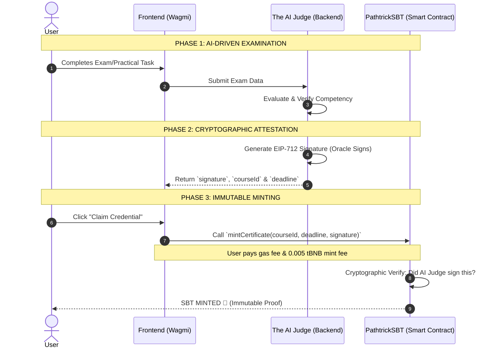

<p align="center">
  
</p>

# Pathtrick

**A verifiable, AI-native career coach on BNB Smart Chain: learn, get graded by an objective AI Judge, and earn Soulbound credentials no one can fake.**

> Your skills, judged by AI, proven on-chain.

🌐 **Live app:** [pathtrick.vercel.app](https://pathtrick.vercel.app) · 📜 **Contract:** [`0x3963…7ba9`](https://testnet.bscscan.com/address/0x39632892C33435a76043343Ef17Ac03124627ba9) on BNB Smart Chain Testnet

[](https://pathtrick.vercel.app)
[-F0B90B?logo=binance&logoColor=white)](https://testnet.bscscan.com/address/0x39632892C33435a76043343Ef17Ac03124627ba9)
[](#on-chain-bnb-smart-chain-testnet-chain-97)
[](https://eips.ethereum.org/EIPS/eip-712)
[](#audit-posture)
[](https://docs.soliditylang.org)
[](https://nextjs.org)
[](https://fastify.dev)
[](https://groq.com)
[](./LICENSE)

🏆 **Indonesia Web3 Hackathon Submission**

---

## Table of Contents
- [The Pitch](#the-pitch)
- [What's Live](#whats-live)
- [Key Features](#key-features)
- [Tech Stack](#tech-stack)
- [How It Works (Mechanism)](#how-it-works-mechanism)
- [Architecture](#architecture)
- [Backend API & AI Agents](#backend-api--ai-agents)
- [Audit Posture](#audit-posture)
- [Security Model](#security-model)
- [On-Chain (BNB Smart Chain Testnet, Chain 97)](#on-chain-bnb-smart-chain-testnet-chain-97)
- [Quickstart](#quickstart)
- [Deployment & CI/CD](#deployment--cicd)
- [Repository Structure](#repository-structure)
- [Hackathon](#hackathon)
- [Team](#team)
- [Contributing](#contributing)
- [License](#license)

---

## THE PITCH

Certificates today prove that you *attended*, not that you *can*. Most Web3 education platforms are just "digital stampers": they take off-chain, human-graded results and put them on a blockchain. The grading is still exposed to human bias, and credentials can still be manipulated or backdated.

**Pathtrick closes the loop between AI evaluation and on-chain issuance.**

- **Learners** take an AI career assessment, get a personalized path, and learn through a gamified RPG world. There are two journeys:
  - **Dreamer**: for students and fresh graduates still exploring. They get a RIASEC profile and a career path.
  - **Chaser**: for professionals upskilling. They get a skill-gap analysis and a learning path.
- **The AI Judge** grades every exam against a rubric and returns a deterministic `PASS` / `FAIL`. No human in the loop and no favoritism.
- **The Smart Contract** only mints a credential if the AI Judge has cryptographically signed it (EIP-712). The result is a **Soulbound Token**: non-transferable, permanent, and verifiable by any recruiter in one click.

The result: a credential that is an objective, tamper-proof reflection of real competency, not a stamp.

---

## WHAT'S LIVE

| Surface | Status | Where |
|---|---|---|
| **PathtrickSBT** on BNB Smart Chain Testnet (BEP-1155 Soulbound, EIP-712 gated) | **Live** | [`0x39632892…7ba9`](https://testnet.bscscan.com/address/0x39632892C33435a76043343Ef17Ac03124627ba9) · [deploy tx](https://testnet.bscscan.com/tx/0x1abbe02fb1aa9376f496eff4649d95d8df559e4c075ab452b0c32df74d9e1669) |
| **Frontend** (Next.js 16 + Phaser RPG + Privy) | **Live** | [pathtrick.vercel.app](https://pathtrick.vercel.app) |
| **Backend API + 3 AI Agents** (Fastify + Prisma + PostgreSQL) | **Live** | Railway |
| **CI pipeline** (lint + build for frontend & backend) | **Live** | [`.github/workflows/ci.yml`](./.github/workflows/ci.yml) |
| Real IPFS metadata for SBTs | Planned | Currently uses a placeholder URI, updatable via `setURI` |
| BNB Smart Chain Mainnet deployment | Planned | After hackathon |

> [!NOTE]
> Pathtrick is a **hackathon MVP on testnet**. All mints use test BNB (tBNB). The contract and backend are production-shaped (signature gating, key separation, guardrails), but they have not been through a third-party audit.

---

## KEY FEATURES

| Feature &nbsp;&nbsp;&nbsp;&nbsp;&nbsp;&nbsp;&nbsp;&nbsp;&nbsp;&nbsp;&nbsp;&nbsp;&nbsp;&nbsp;&nbsp;&nbsp;&nbsp;&nbsp;&nbsp;&nbsp;&nbsp;&nbsp;&nbsp;&nbsp;&nbsp;&nbsp;&nbsp;&nbsp;&nbsp;&nbsp;&nbsp;&nbsp;&nbsp;&nbsp;&nbsp;&nbsp;&nbsp;&nbsp; | What it does |
|---------|--------------|
| 🧭 **AI Career Assessment** | Onboarding test that maps users to a RIASEC profile (Dreamer) or a skill-gap analysis (Chaser). |
| 🗺️ **Personalized Roadmap** | AI-generated missions, courses, and quests tailored to each user's goal. |
| 🎮 **Gamified RPG World** | Built with Phaser: XP, lives, houses, badges, leaderboard, and boss-fight style exams with music & SFX. |
| ⚖️ **The AI Judge** | Objective, rubric-based grading of essays and projects, backed by a knowledge base (embeddings). |
| 🎓 **Soulbound Certificates** | Non-transferable BEP-1155 tokens, minted only with the AI Judge's EIP-712 signature. |
| 🏫 **Opportunities Hub** | Curated universities, scholarships, and job listings connected to the user's path. |
| 🔐 **Web2.5 Onboarding** | Log in with email/social via Privy. An embedded wallet is created automatically, so no seed phrase is needed. |
| 🛠️ **Admin Console** | Manage courses, chapters, quizzes, jobs, scholarships, universities, roles, and the AI knowledge base. Includes AI-assisted course generation. |

---

## TECH STACK

| Layer | Technologies |
|-------|--------------|
| **Frontend** | Next.js 16, React 19, TypeScript, Tailwind CSS 4, Phaser 3 (RPG Engine), Privy (Auth), Wagmi, Viem |
| **Backend** | Node.js, Fastify 5, TypeScript, Prisma, PostgreSQL, Zod, Groq API (LLM), Cohere (Embeddings) |
| **Smart Contract** | Solidity 0.8.28, Foundry, OpenZeppelin, BEP-1155 (SBT), EIP-712 (Signatures) |
| **Infra & DevOps** | Vercel (Frontend), Railway (Backend + PostgreSQL), GitHub Actions (CI) |

---

## HOW IT WORKS (MECHANISM)

The platform bridges AI evaluation (off-chain) with Smart Contract verification (on-chain) without having to trust any human grader.



| Layer | What it does |
|-------|--------------|
| **Frontend Client** | A Next.js Web3 interface using **Wagmi & Viem** for wallet connection, interacting with the AI, and triggering blockchain transactions. |
| **The AI Judge (Backend)** | The AI Oracle bridging off-chain evaluation and on-chain issuance. It safely holds a *Private Key* to generate EIP-712 signatures upon user graduation. |
| **Smart Contract (SBT)** | A BEP-1155 contract on BNB Chain. It enforces the rule that *no token can be minted without the AI's cryptographic signature*. |
| **Double-Mint Guard** | An on-chain mapping (`hasCertificate`) that blocks replay attacks, so each wallet can only claim one certificate per course. |

---

## ARCHITECTURE

```
+---------------------------------------------------------------------+
|                 BNB Smart Chain Testnet (chain 97)                  |
|                                                                     |
|    PathtrickSBT (Solidity 0.8.28, BEP-1155 Soulbound)               |
|       mintCertificate(courseId, deadline, signature)  payable       |
|         -> verify EIP-712 sig from adminSigner                      |
|         -> check deadline, fee (0.005 tBNB), hasCertificate         |
|       setAdminSigner / setMintPrice / setURI / withdraw  (owner)    |
|       transfers & approvals                              DISABLED   |
+---------------------------------------------------------------------+
            ^                                        ^
            | mint tx (user wallet)                  | signer address
            |                                        | (adminSigner)
   +-----------------+    REST + JWT    +-------------------------------+
   |    Frontend     | <--------------> |        Backend (Fastify)      |
   |  Next.js 16     |                  |                               |
   |  Phaser RPG     |                  |  Agent 1  Dreamer  (RIASEC)   |
   |  Privy + Wagmi  |                  |  Agent 2  Chaser   (Skills)   |
   |  (Vercel)       |                  |  Agent 3  AI Judge (Grading)  |
   +-----------------+                  |  EIP-712 Signer               |
            ^                           |  (Railway)                    |
            | login                     +-------------------------------+
   +-----------------+                     |            |           |
   |      Privy      |               +-----------+ +----------+ +---------+
   |  Auth + Wallet  |               | PostgreSQL| | Groq LLM | | Cohere  |
   +-----------------+               |  (Prisma) | |          | | Embed.  |
                                     +-----------+ +----------+ +---------+
```

---

## BACKEND API & AI AGENTS

Core REST endpoints exposed by the Fastify backend (all under `/api`, protected by the app JWT unless noted):

| Endpoint | Purpose |
|----------|---------|
| `GET /health` | Liveness check (public). |
| `POST /api/auth/sync` | Verifies the Privy access token and issues the app's session JWT. |
| `GET /api/users/me` · `POST /api/users/me/role` | Current user profile and role selection (Dreamer / Chaser). |
| `GET /api/riasec/questions` · `POST /api/assessment` | Onboarding test. Triggers Agent 1 / Agent 2 to build the profile and roadmap. |
| `GET /api/roadmap` · `/api/missions/:missionId/*` | Personalized missions, mission quizzes, and project submissions. |
| `GET /api/courses` · `/api/courses/:courseId/sections/:sectionId/{quiz,project}/submit` | Course content, quizzes, and projects graded by the AI Judge. |
| `GET /api/quests` · `POST /api/quests/:id/claim` | In-game quests and rewards. |
| `GET /api/gamification` · `/api/leaderboard` · `/api/badges` · `/api/houses` | XP, lives, badges, houses, and leaderboard. |
| `POST /api/certificates/prepare-mint` | Returns the **EIP-712 signature** + `deadline` for a passed course. |
| `POST /api/certificates/confirm-mint` | Records the on-chain mint tx after the user claims the SBT. |
| `GET /api/universities` · `/api/scholarships` · `/api/jobs` | Opportunities hub. |
| `GET /api/notifications` · `POST /api/notifications/read-all` | In-app notifications. |
| `/api/admin/*` | Admin CRUD for courses, quizzes, jobs, scholarships, universities, roles, users, and the AI knowledge base. Also covers AI course generation (`/api/admin/courses/generate`). |

### The 3 AI Agents Pipeline
The system uses a multi-agent architecture built on the Groq API. Each agent evaluates users at a different stage:

1. **Agent 1: The Dreamer (RIASEC Evaluator)**
   - **Role:** Assesses students or fresh graduates.
   - **Input:** User's initial onboarding essay/answers.
   - **Output:** Classifies the user into RIASEC types and generates a tailored "Career Path" with beginner-friendly missions.

2. **Agent 2: The Chaser (Skill Evaluator)**
   - **Role:** Assesses professionals or those with existing skill sets.
   - **Input:** User's technical onboarding answers.
   - **Output:** Identifies current skill gaps and generates a specific "Learning Path" focused on upskilling.

3. **Agent 3: The AI Judge (Essay Evaluator)**
   - **Role:** The strict, objective grader for all in-game quests and course exams.
   - **Input:** User's answer to a specific course question + the grading rubric + relevant knowledge base context (embeddings).
   - **Output:** Returns a deterministic `PASS`/`FAIL`. If passed, it triggers the backend to sign the cryptographic graduation proof (EIP-712) for SBT minting.

---

## AUDIT POSTURE

**PathtrickSBT (smart contract)**

| Check | Result |
|---|---|
| Foundry unit tests | **17/17 pass** |
| Foundry fuzz tests (256 runs each) | **3/3 pass**: wrong fee, random signature, arbitrary transfers |
| Total | **20 tests, 0 failures** |
| Runtime size | **8,261 bytes** (~34% of the 24,576-byte limit) |
| Compiler | Solidity 0.8.28, optimizer on (200 runs) |

What the test suite covers:
- ✅ Mint succeeds only with a valid signature **and** the exact fee
- ✅ Reverts on invalid signatures, wrong signers, expired `deadline`, and wrong fees
- ✅ Double-mint is blocked
- ✅ `safeTransferFrom` and `setApprovalForAll` always revert (soulbound)
- ✅ Constructor rejects a zero signer and `owner == signer`
- ✅ Only the owner can withdraw, rotate the signer, or change the mint price

**Backend & Frontend:** type-checked and built on every push / PR to `main` via GitHub Actions.

---

## SECURITY MODEL

- **Signature-gated minting**: `mintCertificate` reverts unless the payload is signed by the `adminSigner` (EIP-712 typed data: `user`, `courseId`, `nonce`, `deadline`).
- **Expiring signatures**: each proof carries a `deadline`, so old signatures cannot be reused later.
- **One certificate per course**: the `hasCertificate` mapping blocks double minting and replay attacks.
- **Truly soulbound**: transfers and `setApprovalForAll` are disabled at the contract level.
- **Key separation**: the signer wallet must be different from the owner wallet (enforced in the constructor and `setAdminSigner`). The signer key can also be rotated.
- **AI guardrails**: every LLM call has a timeout, JSON + schema validation (Zod), and ID checks against real candidates. Any failure falls back safely instead of passing raw errors to the user.
- **Auth layering**: Privy tokens are verified server-side (Ed25519), then exchanged for a short-lived app JWT. Admin access is checked against the database role.

---

## ON-CHAIN (BNB SMART CHAIN TESTNET, CHAIN 97)

| Component | Address | Notes |
|-----------|---------|-------|
| **PathtrickSBT** (Core Contract) | [`0x39632892C33435a76043343Ef17Ac03124627ba9`](https://testnet.bscscan.com/address/0x39632892C33435a76043343Ef17Ac03124627ba9) | [Deploy tx](https://testnet.bscscan.com/tx/0x1abbe02fb1aa9376f496eff4649d95d8df559e4c075ab452b0c32df74d9e1669) |
| AI Judge Wallet (Admin Signer) | [`0x6C240DB75811f513515A366057e43de7b313E6eD`](https://testnet.bscscan.com/address/0x6C240DB75811f513515A366057e43de7b313E6eD) | Off-chain Oracle, signs EIP-712 proofs |
| Contract Owner | [`0x95dF082d053007cb5c16d3209D21B4344132E75e`](https://testnet.bscscan.com/address/0x95dF082d053007cb5c16d3209D21B4344132E75e) | Fee, signer rotation, URI, withdraw |
| Mint Fee | `0.005 tBNB` | `mintPrice()`, adjustable by owner |

Full deployment record: [`smart-contract/broadcast/Deploy.s.sol/97/run-latest.json`](./smart-contract/broadcast/Deploy.s.sol/97/run-latest.json).

### Mint fee & treasury
Every successful mint collects a **0.005 tBNB** fee inside the contract on top of gas. The owner can pull these funds with `withdraw()`. The model is meant to keep the AI evaluation infrastructure running sustainably once Pathtrick moves to mainnet.

---

## QUICKSTART

**Prerequisites:** Node.js 20+, npm, PostgreSQL, and [Foundry](https://book.getfoundry.sh/) (for smart contracts).

```bash
git clone https://github.com/westoryyyy/PathTrick.git
cd PathTrick
```

### 1. Backend (AI Engine)
The AI Oracle that runs the LLM evaluations and signs graduation proofs.
```bash
cd backend
npm install
cp .env.example .env          # fill in the values below
npx prisma migrate dev        # create database tables
npm run prisma:seed           # seed initial data
npm run dev
# API running at http://localhost:8080
```

| Variable | What it is |
|----------|------------|
| `DATABASE_URL` | PostgreSQL connection string. |
| `CORS_ORIGIN` | Allowed frontend origin (e.g. `http://localhost:3000`). |
| `PRIVY_APP_ID` / `PRIVY_VERIFICATION_KEY` | From the Privy dashboard, used to verify user login tokens. |
| `APP_JWT_SECRET` / `APP_JWT_EXPIRES_IN` | Secret & lifetime for the app-issued session JWT. |
| `GROQ_API_KEY` | LLM provider key used by all 3 AI Agents. |
| `COHERE_API_KEY` | Embedding provider key for the AI Judge knowledge base. |
| `SIGNER_PRIVATE_KEY` | Dedicated wallet key used by The AI Judge to sign EIP-712 proofs. Must match the contract's `adminSigner`. |
| `CONTRACT_ADDRESS` / `CHAIN_ID` | Deployed PathtrickSBT address and chain ID (`97`). |

### 2. Frontend (Web UI)
The main client interface for users to log in, learn, play, and claim SBTs.
```bash
cd frontend
npm install
cp .env.example .env.local
npm run dev
# Open http://localhost:3000
```

| Variable | What it is |
|----------|------------|
| `NEXT_PUBLIC_PRIVY_APP_ID` | Privy App ID for login & embedded wallets. |
| `NEXT_PUBLIC_API_URL` | Backend base URL (e.g. `http://localhost:8080/api`). |
| `NEXT_PUBLIC_PATHTRICK_SBT_ADDRESS` | The deployed PathtrickSBT contract address on BNB Smart Chain Testnet. |
| `NEXT_PUBLIC_BNB_TESTNET_RPC_URL` | BNB Chain Testnet RPC URL. |
| `NEXT_PUBLIC_CHAIN_ID` | `97` for BNB Smart Chain Testnet. |

### 3. Smart Contract (Foundry)
```bash
cd smart-contract
forge build
forge test -vvv          # 20 tests (17 unit + 3 fuzz)
```

Deploy to BNB Testnet:
```bash
PRIVATE_KEY=0x... \
OWNER_ADDRESS=0x... \
ADMIN_SIGNER=0x... \
BNB_TESTNET_RPC_URL=https://data-seed-prebsc-1-s1.binance.org:8545 \
BSCSCAN_API_KEY=... \
forge script script/Deploy.s.sol:Deploy --rpc-url bnb_testnet --broadcast --verify -vvvv
```

`Deploy.s.sol` checks after deployment that `owner` and `adminSigner` were set correctly. The constructor itself rejects `owner == adminSigner`.

---

## DEPLOYMENT & CI/CD

| Component | Platform | Notes |
|-----------|----------|-------|
| Frontend | **Vercel** | Auto-deploys from `main`. Root directory: `frontend/`. |
| Backend + Database | **Railway** | Fastify API + PostgreSQL. `CORS_ORIGIN` points to the Vercel domain. |
| Smart Contract | **BNB Smart Chain Testnet** | Deployed via Foundry script. |
| CI | **GitHub Actions** | On every push / PR to `main`: frontend `lint` + `build`, backend `prisma generate` + `tsc` build. |

---

## REPOSITORY STRUCTURE

```
PathTrick/
├── frontend/          # Next.js app (UI, Phaser RPG, Privy + Wagmi wallet)
│   ├── src/app/       # App Router pages: (auth), (dashboard), (game), profile, docs
│   └── public/        # Game assets, sprites, music & sound effects
├── backend/           # Fastify API + AI Agents + EIP-712 signer
│   ├── src/modules/   # Feature modules (auth, assessment, courses, quests, certificates, ...)
│   ├── src/lib/       # Groq, embeddings, Privy, blockchain signer, guardrail
│   └── prisma/        # Schema, migrations & seed scripts
├── smart-contract/    # Foundry project
│   ├── src/           # PathtrickSBT.sol (BEP-1155 Soulbound)
│   ├── script/        # Deploy.s.sol
│   └── test/          # PathtrickSBT.t.sol (unit + fuzz)
└── .github/workflows/ # CI pipeline (lint + build)
```

---

## HACKATHON

Built for the **Indonesia Web3 Hackathon** on **BNB Smart Chain**.

What this submission delivers:
- ✅ Smart contract deployed on BNB Smart Chain Testnet (chain 97)
- ✅ Live, publicly accessible frontend
- ✅ Live backend with 3 specialized AI agents
- ✅ End-to-end flow: assessment → learning → AI grading → EIP-712 signature → SBT mint
- ✅ Tested contract (20/20 Foundry tests, including fuzzing)
- ✅ Open-source under the MIT license

---

## TEAM

| Name | Role |
|------|------|
| **Rotua Paulina** | Product Manager & Smart Contract Engineer |
| **Renatha Amelia Manggala Putri** | Backend Engineer & AI Engineer |
| **Grace Yoelanda Turnip** | Frontend Engineer |
| **Nabilah Aprilia Darwin** | Visual & Assets Artist |

---

## CONTRIBUTING

Issues and PRs are welcome. Before opening a PR, please run:

```bash
# Smart contract
cd smart-contract && forge fmt && forge test

# Frontend
cd frontend && npm run lint && npm run build

# Backend
cd backend && npx prisma generate && npm run build
```

---

## LICENSE

[MIT](./LICENSE) © 2026 KETUPAT

<p align="center"><i>Building the future of verifiable, AI-driven education on BNB Chain.</i></p>
