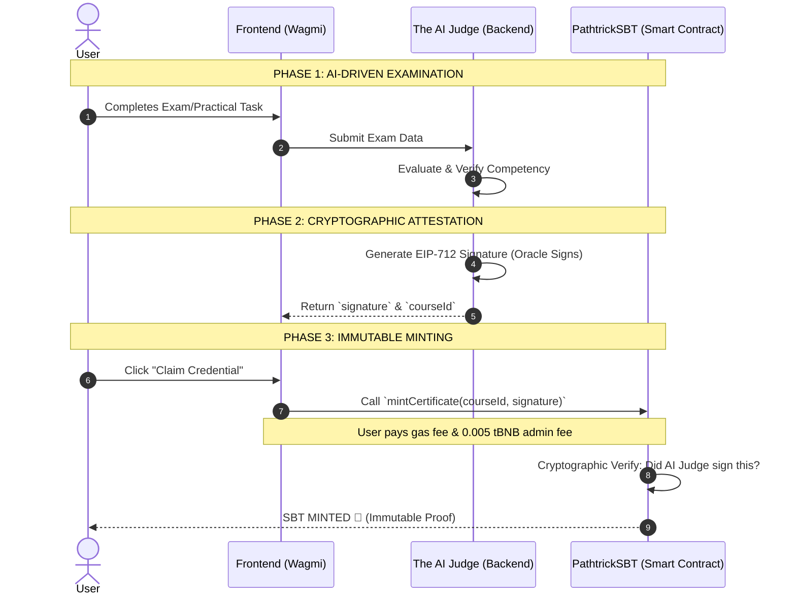

# 🌟 PATHTRICK

**A verifiable, decentralized AI-Native Career Coach on BNB Smart Chain.** 
It evaluates skills through an objective AI engine, signs graduation proofs securely via EIP-712 cryptography, and issues immutable credentials as Soulbound Tokens (SBT).

🏆 **Indonesia Web3 Hackathon Submission**
---

## WHAT PATHTRICK IS

Pathtrick is an autonomous career coaching and certification platform built on three commitments:

**Personalized Learning.** The AI acts as a dedicated career coach, curating study materials and guiding users through educational paths tailored to their specific career goals.

**Objective AI Evaluation.** Exams are graded deterministically by *The AI Judge*. It eliminates human bias, subjectivity, and manual manipulation from the grading process.

**Immutable Proof.** Once passed, the certification is minted as a Soulbound Token (SBT) on BNB Smart Chain. It is non-transferable, permanently attached to the user's digital identity, and easily verifiable by recruiters worldwide.

---

## PROBLEM & SOLUTION

Most Web3 educational platforms serve merely as "digital stampers" for conventional human institutions. They take off-chain, human-graded results and simply put them on a blockchain. This traditional approach leaves the quality of education vulnerable to human bias and makes it easy to manipulate or backdate credentials.

**Pathtrick solves this through a "Closed-Loop" AI-to-Blockchain system.** 
We do not just place a certificate on the blockchain; we mathematically guarantee the authenticity of the skill behind it. By eliminating the human intermediary, every credential issued is an objective, tamper-proof reflection of true competency.

---

## TECH STACK

**Frontend:** Next.js, React, TypeScript, Tailwind CSS, Phaser (RPG Engine), Privy (Auth), Wagmi, Viem.
**Backend:** Node.js, Fastify, TypeScript, Prisma, PostgreSQL, Groq API (AI LLM).
**Smart Contract:** Solidity, Foundry, BNB Smart Chain (Testnet), ERC-1155 (SBT), EIP-712 (Signatures).

---

## HOW IT WORKS

The platform seamlessly bridges AI evaluation (off-chain) with Smart Contract verification (on-chain) in a completely trustless manner.



The system is rigorously isolated. The execution layer never shares keys, and the smart contract acts as a strict on-chain gatekeeper.

| Layer | What it does |
|-------|--------------|
| **Frontend Client** | A Next.js Web3 interface using **Wagmi & Viem** for wallet connection, interacting with the AI, and triggering blockchain transactions. |
| **The AI Judge (Backend)** | The AI Oracle bridging off-chain evaluation and on-chain issuance. It safely holds a *Private Key* to generate EIP-712 signatures upon user graduation. |
| **Smart Contract (SBT)** | A highly optimized BEP-1155 contract on BNB Chain. It enforces the rule that *no token can be minted without the AI's cryptographic signature*. |
| **Double-Mint Guard** | An on-chain strict mapping (`hasCertificate`) that acts as a circuit breaker against replay attacks, ensuring each user wallet can only claim one certificate per course. |

| Deploy unit | What lives there |
|-------------|------------------|
| `backend/` | Python/Node engine, LLM prompts, AI evaluation logic, EIP-712 Signature generator |
| `smart-contract/` | Foundry: PathtrickSBT (BEP-1155), Signature Verifier (ECDSA) on BSC Testnet |
| `frontend/` | Next.js read-only public UI, user dashboard, wallet connections |

---

## BACKEND API & AI AGENTS

The backend exposes several core REST API modules via Fastify:

- **`/api/assessment`**: Core onboarding API. Triggers the AI Agents to evaluate the user's initial test and generate their RIASEC profile, learning/career path, and missions.
- **`/api/courses` & `/api/quests`**: Serves study materials, quizzes, and practical tasks.
- **`/api/gamification`**: Handles XP, Lives, Leaderboard, and issues EIP-712 Certificates upon graduation.
- **`/api/users` & `/api/auth`**: Manages user profiles, role selection (Dreamer/Chaser), and Privy JWT validation.

### The 3 AI Agents Pipeline
The system utilizes a specialized multi-agent architecture built on Groq API to evaluate users at different stages:

1. **Agent 1: The Dreamer (RIASEC Evaluator)**
   - **Role:** Assesses students or fresh graduates.
   - **Input:** User's initial onboarding essay/answers.
   - **Output:** Classifies the user into RIASEC types and generates a tailored "Career Path" with beginner-friendly missions.
2. **Agent 2: The Chaser (Skill Evaluator)**
   - **Role:** Assesses professionals or those with existing skill sets.
   - **Input:** User's technical onboarding answers.
   - **Output:** Identifies current skill gaps and generates a specific "Learning Path" focused on upskilling.
3. **Agent 3: The AI Judge (Essay Evaluator)**
   - **Role:** The strict, objective grader for all in-game quests and course exams.
   - **Input:** User's answer to a specific course question + the grading rubric.
   - **Output:** Returns a deterministic `PASS`/`FAIL`. If passed, it triggers the backend to sign the cryptographic graduation proof (EIP-712) for SBT minting.

---

## QUICKSTART

Three ways in, depending on what you want to test.

### 1. Frontend (Web UI)
The main client interface for users to connect wallets, learn, and claim SBTs.
```bash
cd frontend
npm install
cp .env.example .env.local
npm run dev
# Open http://localhost:3000
```

The `.env.local` values you will want for the frontend:

| Variable | What it is |
|----------|------------|
| `NEXT_PUBLIC_CONTRACT_ADDRESS` | The deployed PathtrickSBT contract address on BNB Smart Chain Testnet. |
| `NEXT_PUBLIC_RPC_URL` | BNB Chain RPC URL (e.g., from public bsc-testnet endpoints). |

### 2. Backend (AI Engine)
The AI Oracle that runs the LLM evaluations. *(Check `backend/README.md` for full Python/Node dependency installation)*.
```bash
cd backend
cp .env.example .env
# Start the AI Judge server
```

The `.env` values you will want for the backend:

| Variable | What it is |
|----------|------------|
| `ADMIN_PRIVATE_KEY` | The private key used by The AI Judge to sign EIP-712 graduation proofs. Must match the contract's expected signer. |
| `AI_API_KEY` | Your LLM provider API key (e.g., OpenAI, Anthropic) to evaluate user exams. |

### 3. Develop & Deploy (Foundry)
The BNB Smart Chain contracts. Developed and tested using Foundry.
```bash
cd smart-contract
forge build
forge test -vvv
# Deploy to BNB Testnet
forge script script/Deploy.s.sol:Deploy --rpc-url bnb_testnet --broadcast --verify -vvvv
```

---

## ON-CHAIN (BNB SMART CHAIN TESTNET, CHAIN 97)

Everything below is verified on BNB Smart Chain Testnet.

| What | Address | Proof |
|------|---------|-------|
| AI Judge Wallet (Signer) | `0x...[AI_WALLET]` | Off-chain Oracle, signs EIP-712 |
| PathtrickSBT (Core Contract) | contract `0x...[CONTRACT_ADDR]` | Verified on BscScan Testnet |
| Soulbound Metadata | URI `https://[pathtrick-api]/api/metadata/{id}` | Read directly from contract |

---

## TEAM

| Name | Role |
|------|------|
| **Rotua Paulina** | Smart Contract Engineer and Product Manager |
| **Renatha Amelia Manggala Putri** | Backend Engineer and AI Engineer |
| **Grace Yoelanda Turnip** | Frontend Engineer |
| **Nabilah Aprilia Darwin** | Visual and Assets Artist |

*Building the future of verifiable, AI-driven education on BNB Chain.*
