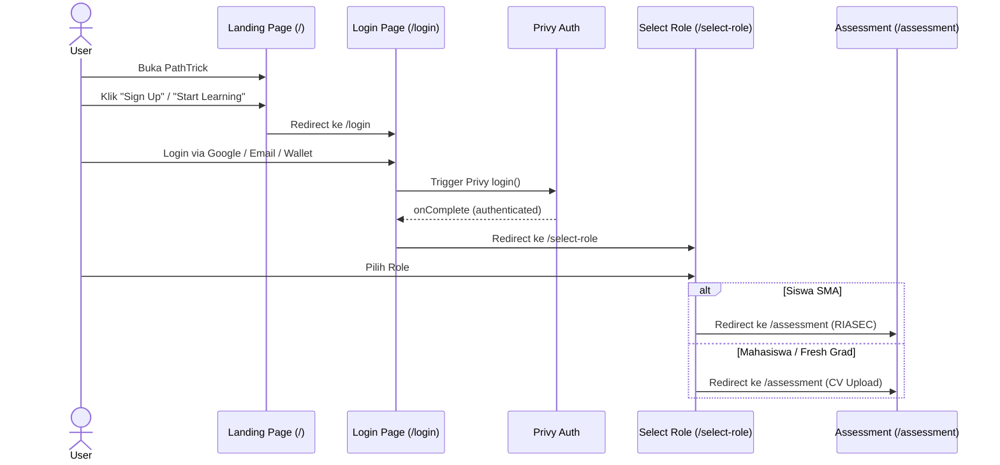
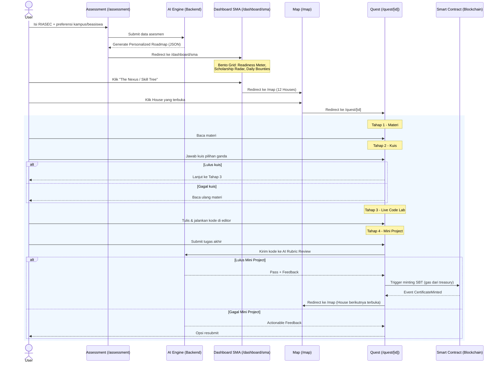
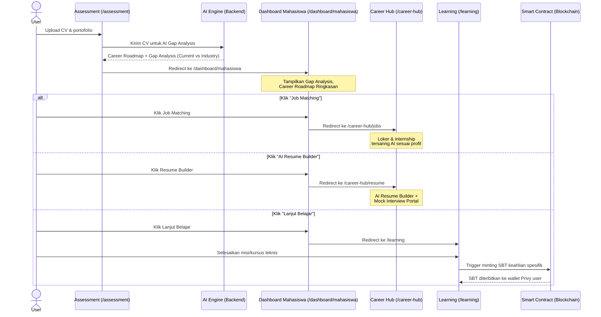
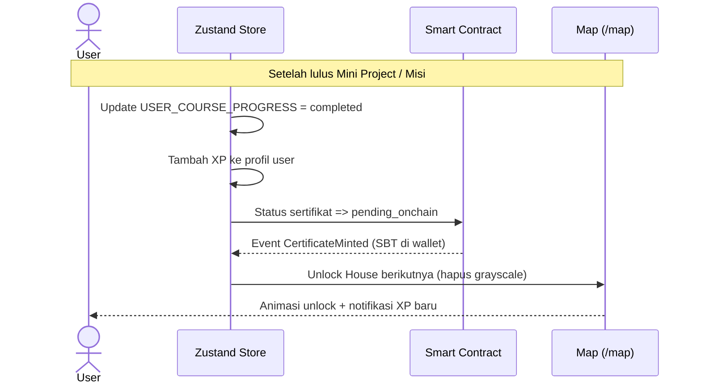

# PathTrick — User Flow Sequence Diagram

## 1. Alur Autentikasi & Onboarding

```mermaid
sequenceDiagram
    actor U as User
    participant LP as Landing Page (/)
    participant LG as Login Page (/login)
    participant PV as Privy Auth
    participant SR as Select Role (/select-role)
    participant AS as Assessment (/assessment)

    U->>LP: Buka PathTrick
    U->>LP: Klik "Sign Up" / "Start Learning"
    LP->>LG: Redirect ke /login
    U->>LG: Login via Google / Email / Wallet
    LG->>PV: Trigger Privy login()
    PV-->>LG: onComplete (authenticated)
    LG->>SR: Redirect ke /select-role

    U->>SR: Pilih Role
    alt Siswa SMA
        SR->>AS: Redirect ke /assessment (RIASEC)
    else Mahasiswa / Fresh Grad
        SR->>AS: Redirect ke /assessment (CV Upload)
    end
```

---

## 2. Jalur Siswa SMA

```mermaid
sequenceDiagram
    actor U as User
    participant AS as Assessment (/assessment)
    participant AI as AI Engine (Backend)
    participant DS as Dashboard SMA (/dashboard/sma)
    participant MP as Map (/map)
    participant QS as Quest (/quest/[id])
    participant SC as Smart Contract (Blockchain)

    U->>AS: Isi RIASEC + preferensi kampus/beasiswa
    AS->>AI: Submit data asesmen
    AI-->>AS: Generate Personalized Roadmap (JSON)
    AS->>DS: Redirect ke /dashboard/sma

    Note over DS: Bento Grid: Readiness Meter,<br/>Scholarship Radar, Daily Bounties

    U->>DS: Klik "The Nexus / Skill Tree"
    DS->>MP: Redirect ke /map (12 Houses)

    U->>MP: Klik House yang terbuka
    MP->>QS: Redirect ke /quest/[id]

    rect rgb(240, 248, 255)
        Note over QS: Tahap 1 - Materi
        U->>QS: Baca materi

        Note over QS: Tahap 2 - Kuis
        U->>QS: Jawab kuis pilihan ganda
        alt Lulus kuis
            QS-->>U: Lanjut ke Tahap 3
        else Gagal kuis
            QS-->>U: Baca ulang materi
        end

        Note over QS: Tahap 3 - Live Code Lab
        U->>QS: Tulis & jalankan kode di editor

        Note over QS: Tahap 4 - Mini Project
        U->>QS: Submit tugas akhir
        QS->>AI: Kirim kode ke AI Rubric Review
        alt Lulus Mini Project
            AI-->>QS: Pass + Feedback
            QS->>SC: Trigger minting SBT (gas dari treasury)
            SC-->>QS: Event CertificateMinted
            QS->>MP: Redirect ke /map (House berikutnya terbuka)
        else Gagal Mini Project
            AI-->>QS: Actionable Feedback
            QS-->>U: Opsi resubmit
        end
    end
```

---

## 3. Jalur Mahasiswa / Fresh Grad

```mermaid
sequenceDiagram
    actor U as User
    participant AS as Assessment (/assessment)
    participant AI as AI Engine (Backend)
    participant DM as Dashboard Mahasiswa (/dashboard/mahasiswa)
    participant CH as Career Hub (/career-hub)
    participant LN as Learning (/learning)
    participant SC as Smart Contract (Blockchain)

    U->>AS: Upload CV & portofolio
    AS->>AI: Kirim CV untuk AI Gap Analysis
    AI-->>AS: Career Roadmap + Gap Analysis (Current vs Industry)
    AS->>DM: Redirect ke /dashboard/mahasiswa

    Note over DM: Tampilkan Gap Analysis,<br/>Career Roadmap Ringkasan

    alt Klik "Job Matching"
        U->>DM: Klik Job Matching
        DM->>CH: Redirect ke /career-hub/jobs
        Note over CH: Loker & internship<br/>tersaring AI sesuai profil
    else Klik "AI Resume Builder"
        U->>DM: Klik Resume Builder
        DM->>CH: Redirect ke /career-hub/resume
        Note over CH: AI Resume Builder +<br/>Mock Interview Portal
    else Klik "Lanjut Belajar"
        U->>DM: Klik Lanjut Belajar
        DM->>LN: Redirect ke /learning
        U->>LN: Selesaikan misi/kursus teknis
        LN->>SC: Trigger minting SBT keahlian spesifik
        SC-->>LN: SBT diterbitkan ke wallet Privy user
    end
```

---

## 4. Sistem XP & Progression

```mermaid
sequenceDiagram
    actor U as User
    participant ZS as Zustand Store
    participant SC as Smart Contract
    participant MP as Map (/map)

    Note over U,MP: Setelah lulus Mini Project / Misi

    ZS->>ZS: Update USER_COURSE_PROGRESS = completed
    ZS->>ZS: Tambah XP ke profil user
    ZS->>SC: Status sertifikat => pending_onchain
    SC-->>ZS: Event CertificateMinted (SBT di wallet)
    ZS->>MP: Unlock House berikutnya (hapus grayscale)
    MP-->>U: Animasi unlock + notifikasi XP baru
```
