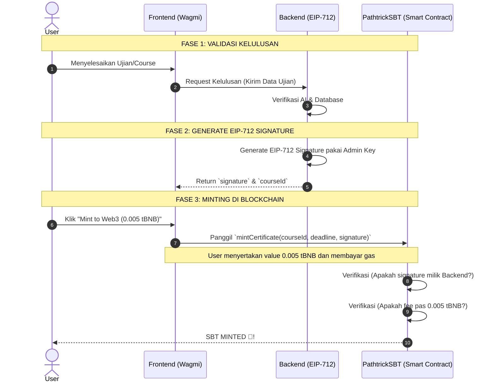

# 📜 Pathtrick Smart Contract (`PathtrickSBT.sol`)

Repositori ini khusus menampung *Smart Contract* untuk ekosistem **PATHTRICK**. Contract ini bertanggung jawab atas penerbitan kredensial akademik *on-chain* dalam bentuk *Soulbound Token* (SBT) di jaringan BNB Smart Chain (Testnet/Mainnet).

---

## 🏗️ Arsitektur Smart Contract

Smart Contract Pathtrick bukan sekadar NFT biasa, melainkan sebuah sistem kredensial akademik *on-chain* yang dirancang dengan 5 pilar utama:

### 1. Standar BEP-1155 (Efisiensi Gas)
Kita menggunakan standar **ERC-1155 / BEP-1155** alih-alih ERC-721. Alasannya karena BEP-1155 jauh lebih hemat *gas fee* ketika kita menerbitkan sertifikat untuk sebuah *course* (misalnya *course* "Frontend" memiliki ID 1). Semua lulusan *course* tersebut akan di- *mint* di bawah ID yang sama, membuat manajemen data *on-chain* jauh lebih rapi.

### 2. Soulbound Token / Tidak Bisa Dijual (Anti-Fraud)
Sertifikat pendidikan tidak boleh diperjualbelikan. Oleh karena itu, kita memblokir paksa fungsi transfer bawaan dari OpenZeppelin dengan melakukan *override* pada fungsi `_update()`. Jika ada *user* yang mencoba mentransfer tokennya ke dompet lain, transaksi akan langsung gagal (*revert*). Ini menjamin **100% keaslian (Authenticity)** bahwa pemegang SBT adalah orang yang benar-benar lulus ujian.

### 3. Validasi AI via EIP-712 Signature (Keamanan Off-Chain ke On-Chain)
Untuk memastikan *Smart Contract* tahu bahwa seorang *user* sudah lulus ujian AI, kita menggunakan kriptografi **EIP-712 (Typed Data Signature)**.
*   Saat AI Backend menyatakan *user* lulus, Backend akan membuat "Tanda Tangan Digital" menggunakan *Admin Private Key*.
*   *Smart Contract* memiliki fungsi `mintCertificate(courseId, deadline, signature)` yang memverifikasi signature menggunakan `ECDSA.recover`.
*   Jika *signature* tersebut valid dan terbukti berasal dari Backend Pathtrick, barulah sertifikat dicetak. Ini mencegah *Hacker* mencetak sertifikat dari jalur belakang.

### 4. Mencegah Replay-Attack (Double Mint Guard)
Untuk memastikan sistem tidak diakali, *Smart Contract* menyimpan data `hasCertificate[msg.sender][courseId]`. Sekalipun *user* mencoba menggunakan *signature* kelulusan yang sama berulang-ulang, *Smart Contract* hanya akan mengizinkan pencetakan **satu kali saja per user per course**.

### 5. Model Monetisasi Web3-Native (User-Paid Fee)
Alih-alih *platform* yang "membakar uang" untuk mensubsidi biaya *minting* pengguna, kita menggunakan pendekatan **Web3-Native**. *User* diwajibkan mengirim `msg.value` sebesar **0.005 tBNB** ke dalam *Smart Contract* saat mengklaim sertifikat. Ini menciptakan **model bisnis B2C yang sustainable**. Saldo BNB yang terkumpul di dalam *Contract* ini nantinya bisa ditarik oleh Admin ke *Treasury* menggunakan fungsi `withdraw()`.

---

## 🔄 Alur Integrasi (End-to-End User Journey)

Diagram di bawah ini menunjukkan bagaimana Frontend, Backend, dan Smart Contract berinteraksi menggunakan metode EIP-712.



---

## 🛠️ Cara Deploy (Foundry)

Repository ini menggunakan **Foundry**. Pastikan Anda sudah menginstall Foundry (`forge`, `cast`, `anvil`).

### 1. Setup Environment
Buat file `.env` berdasarkan `.env.example`:
```bash
cp .env.example .env
```
Isi file `.env` dengan kredensial Anda:
* `PRIVATE_KEY`: Private Key dompet deployer yang membayar gas deployment.
* `OWNER_ADDRESS`: Alamat owner administrasi; gunakan alamat multisig untuk production.
*   `ADMIN_SIGNER`: Public Address dari dompet Backend yang akan membuat EIP-712 Signature.
*   `BSCSCAN_API_KEY`: API Key BscScan untuk verifikasi contract.
*   `BNB_TESTNET_RPC_URL`: RPC URL BNB Testnet.

### 2. Compile & Test
```bash
forge build
forge test -vvv
```

### 3. Deploy ke BNB Testnet
```bash
forge script script/Deploy.s.sol:Deploy --rpc-url bnb_testnet --broadcast --verify -vvvv
```

Setelah deploy sukses, catat **Contract Address** yang dihasilkan dan masukkan ke dalam *Environment Variables* di Frontend maupun Backend.
