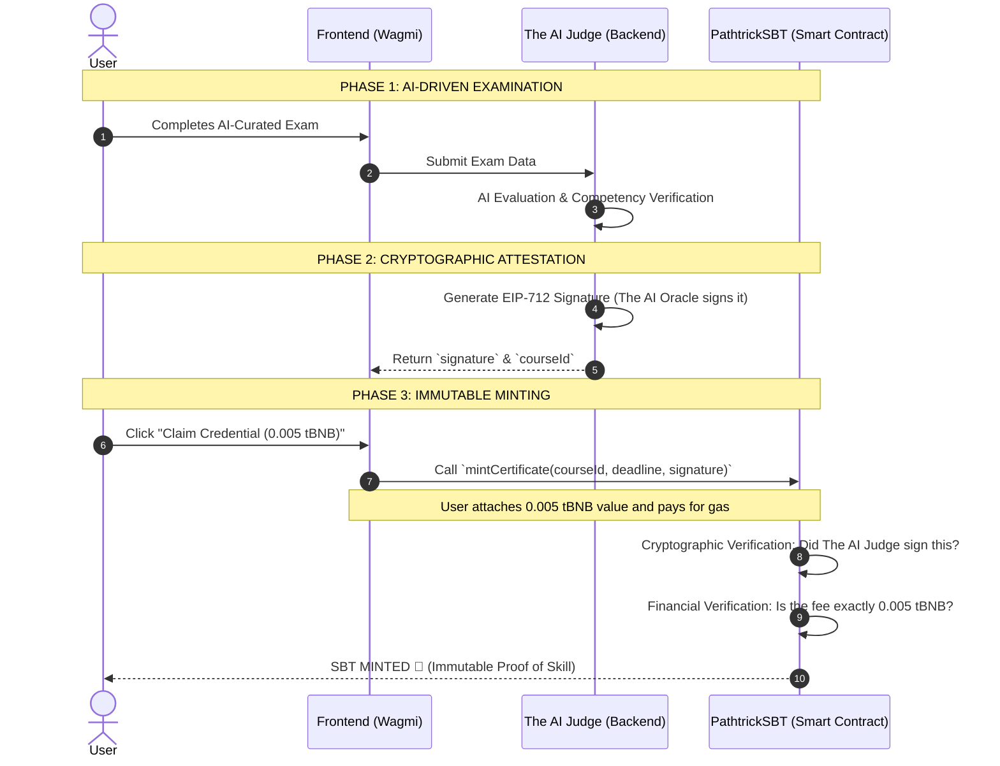

# 📜 Pathtrick: The AI-Native Career Coach

> **Indonesia Web3 Hackathon Submission**

This repository is a **monorepo** hosting the complete **PATHTRICK** ecosystem. It consists of three main components:
- 💻 **`frontend/`**: The Web3 user interface for interacting with the platform.
- 🧠 **`backend/`**: The AI evaluation engine and EIP-712 Signature generator ("The AI Judge").
- 📜 **`smart-contract/`**: The on-chain system responsible for issuing academic credentials in the form of Soulbound Tokens (SBTs) on the BNB Smart Chain (Testnet).

Pathtrick is not just a certification platform; it is an **AI-Native Career Coach**. In our ecosystem, Artificial Intelligence serves as the Tutor, the Examiner, and the very institution that grants graduation.

---

## 👁️ The Vision: AI-Native, Closed-Loop Certification

Most existing Web3 educational platforms serve merely as "digital stampers" for conventional human institutions. They take off-chain, human-graded results and simply put them on a blockchain. This traditional approach leaves the quality of education and grading vulnerable to human bias, manipulation, and subjective standards. 

**Pathtrick solves this through a "Closed-Loop" AI-to-Blockchain system.** 
We do not just place a certificate on the blockchain; we mathematically **guarantee** the authenticity of the skill behind it. By eliminating the human intermediary in the grading process, we ensure that every credential issued is an objective, tamper-proof reflection of a student's true competency.

### Framing the MVP Phase
For this Hackathon MVP phase, our curriculum is highly curated with the highest standards by domain experts (admins) to ensure the smooth operation of our Web3 pipeline. However, the core certificate issuance architecture (from AI to Blockchain) is fully decentralized and designed to be an **Immutable Proof** system where no one can unilaterally alter graduation records without leaving a trace.

---

## 🏗️ Smart Contract Architecture

The Pathtrick Smart Contract is not just a regular NFT; it is a highly secure on-chain academic credential system designed with 5 main pillars:

### 1. BEP-1155 Standard (Gas Efficiency)
We use the **ERC-1155 / BEP-1155** standard instead of ERC-721. The reason is that BEP-1155 is much more gas-efficient when we issue certificates for a specific course (e.g., the "Frontend" course having ID 1). All graduates of that course will be minted under the same ID, making on-chain data management much neater and scalable.

### 2. Soulbound Token / Non-Transferable (Pure Competency & Anti-Fraud)
Educational certificates should not be tradable. Therefore, we forcefully block the default transfer function from OpenZeppelin by overriding the `_update()` function. If a user tries to transfer their token to another wallet, the transaction will instantly fail (revert). This guarantees **100% Authenticity**, ensuring the SBT purely represents the student's competency and that the holder is the person who actually passed the exam.

### 3. AI Validation via EIP-712 Signature (The Certificate that Signs Itself)
To bridge our AI evaluation with the blockchain trustlessly, we use **EIP-712 (Typed Data ECDSA Signatures)** cryptography.
* Our AI Backend acts as **"The AI Judge"** (or AI Oracle Signer). When the AI declares a user passed, it will mathematically sign the proof of graduation creating a "Digital Signature" using the Admin Private Key.
* The Smart Contract has a `mintCertificate(courseId, deadline, signature)` function that rigorously verifies this signature using `ECDSA.recover`.
* Only if the signature is valid and proven to originate directly from The AI Judge, the certificate will be minted. This prevents hackers from minting certificates through a backdoor.

### 4. Preventing Replay-Attacks (Double Mint Guard)
To ensure the system cannot be gamed, the Smart Contract immutably stores the `hasCertificate[msg.sender][courseId]` data. Even if a malicious actor attempts to use the same graduation signature repeatedly, the Smart Contract strictly enforces a rule of **one credential, per user, per course**.

### 5. Web3-Native Monetization Model (User-Paid Fee)
Instead of a platform "burning money" to subsidize users' minting fees, we use a **Web3-Native** economic approach. Users are required to send a `msg.value` of **0.005 tBNB** to the Smart Contract when claiming their certificate. This creates a **sustainable B2C business model**. The accumulated BNB balance in this Contract can later be withdrawn by the Admin to the protocol's Treasury using the `withdraw()` function.

---

## 🔄 Integration Flow (End-to-End User Journey)

This sequence demonstrates how our Frontend, The AI Judge, and the Smart Contract interact seamlessly using the EIP-712 method:



---

## 🛠️ How to Deploy (Foundry)

This repository uses **Foundry**. Ensure you have Foundry installed (`forge`, `cast`, `anvil`).

### 1. Environment Setup
Create a `.env` file based on `.env.example`:
```bash
cp .env.example .env
```
Fill the `.env` file with your credentials:
* `PRIVATE_KEY`: The Private Key of the deployer wallet that pays for deployment gas.
* `OWNER_ADDRESS`: The administrative owner address; use a multisig address for production.
* `ADMIN_SIGNER`: The Public Address of "The AI Judge" (Backend wallet) that will generate EIP-712 Signatures.
* `BSCSCAN_API_KEY`: BscScan API Key for contract verification.
* `BNB_TESTNET_RPC_URL`: BNB Testnet RPC URL.

### 2. Compile & Test
```bash
forge build
forge test -vvv
```

### 3. Deploy to BNB Testnet
```bash
forge script script/Deploy.s.sol:Deploy --rpc-url bnb_testnet --broadcast --verify -vvvv
```

Once deployment is successful, note the generated **Contract Address** and add it to the Environment Variables in both Frontend and Backend.
